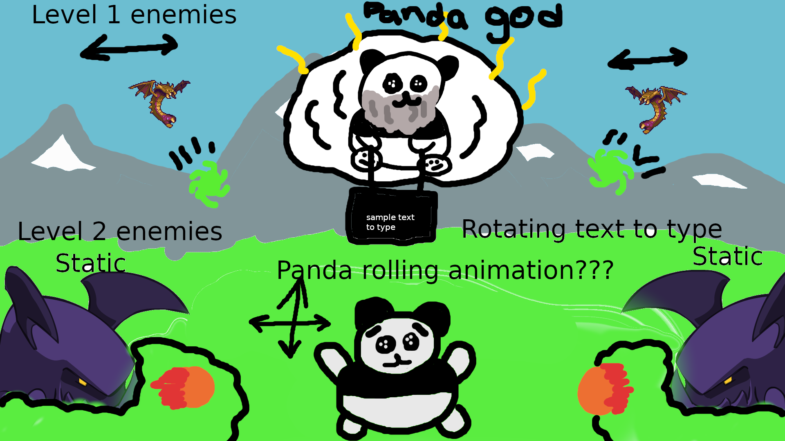

# Panda Bub Me

## The general idea

Be one of the last pandas on the brink of extinction trying to make it through the treacherous fields back to the safety of your bamboo forest. The idea of a typing game intrigues me. The panda will have to dodge projectiles from enemies increasing in number and different attacks to make it through each level (2 to start), while typing the words to be able to make it through. I plan on using canvas for the game.

## MVP

* Have a game screen with a start button and instructions
* One type of enemy
* Movement for central panda Up-Down, Left-Right
* Have text show up that panda god is holding and be able to type it in
* Typing in 5 correct prompts wins the game
* Getting hit by projectile loses 1 life
* Three lives lost and game ends
* Have one stage

## Stretch Goals
* Game screen with current level and amount of lives for panda
* Have the air units move left and right
* Have the panda roll around when moving left and right
* 3+ stages
* 3rd type of enemy
* sound effects
* three wrong typing attempts results in one life being lost

## Potential Roadblocks
* canvas is new to me and it will take me a little to figure out
* the animations could be difficult
* disorganized code as I imagine I will have to collect a lot of things
* having projectiles lock onto the initial position of the player and fire there
