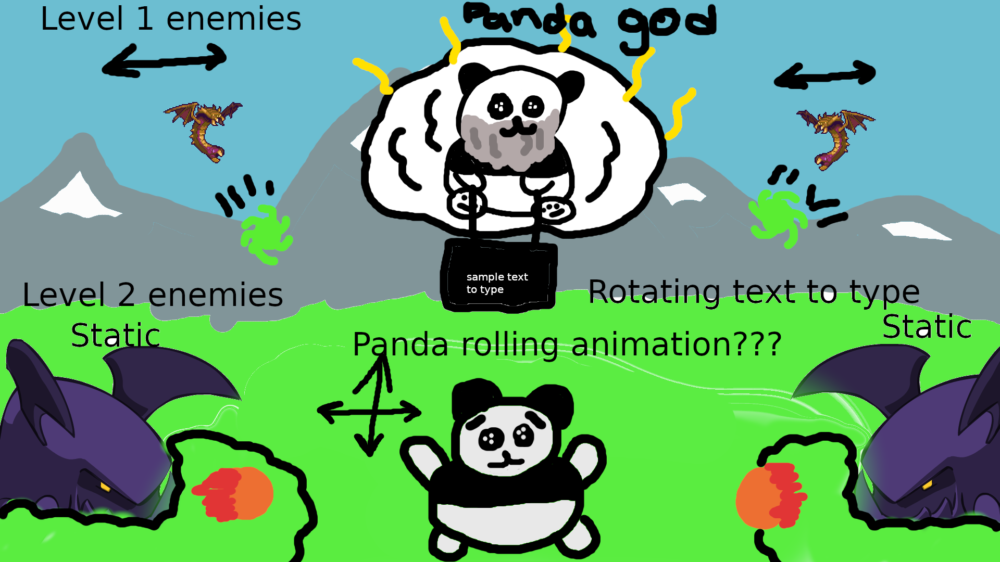

# Panda Bub Me

## The general idea

*You play as a panda who woke up all alone in another part of his region. He must get back to his home, but there are enemies between him and his goal. Your goal is to dodge projectiles while the 30 second timer runs down. If you live with any lives you beat the level.

*I took the approach of making the first level work and building from that point on, it was simpler that way in my mind to get the groundwork going first and proceeding on. Everytime I needed a new level I just needed to set up the same way bu increment my functions one more time.

*I used Canvas with arrays from tiled and assets from itch.io. I found the tiled application to be very easy and fun to use. Implementing collisions was interesting and easy.

*I watched a video of making a basic platformer using tiled and itch.io to get comfortable with the technology and applied myself from then on out.

*I have definitely had growth in my thinking proccess of the DOM, with a lot of aha moments while creating the game. Really simple things that I just havent thought of before that much, like the use of global variables in if else statements to be able to change them and get a different outcome. I struggled a lot coding the collision on the projectiles as it was uncharted territory for me and I encountered a lot of bugs, because of these bugs I won't be able to add in the typing element into my game but im still satisfied with the product.

*https://www.youtube.com/watch?v=rTVoyWu8r6g&t=3202s I used this video to primarily learn the extent of canvas and how to use tiled and itch.io

*https://codeheir.com/2021/07/25/how-to-code-a-top-down-shooter-%F0%9F%94%AB/ I used this to get an idea of how to make the collision detection for projectiles.

https://egordyu.github.io/project-1/
## MVP

* Have a game screen with a start button and instructions
* One type of enemy
* Movement for central panda Up-Down, Left-Right
* Dodge for 30 seconds to win
* Getting hit by projectile loses 1 life
* Three lives lost and game ends
* Have one stage

## Stretch Goals
* Have text show up that panda god is holding and be able to type it in
* Typing in 5 correct prompts wins the game
* Game screen with current level and amount of lives for panda
* Have the air units move left and right
* Have the panda roll around when moving left and right
* 3+ stages
* 3rd type of enemy
* sound effects
* three wrong typing attempts results in one life being lost

## Potential Roadblocks
* canvas is new to me and it will take me a little to figure out
* the animations could be difficult
* disorganized code as I imagine I will have to collect a lot of things
* having projectiles lock onto the initial position of the player and fire there
